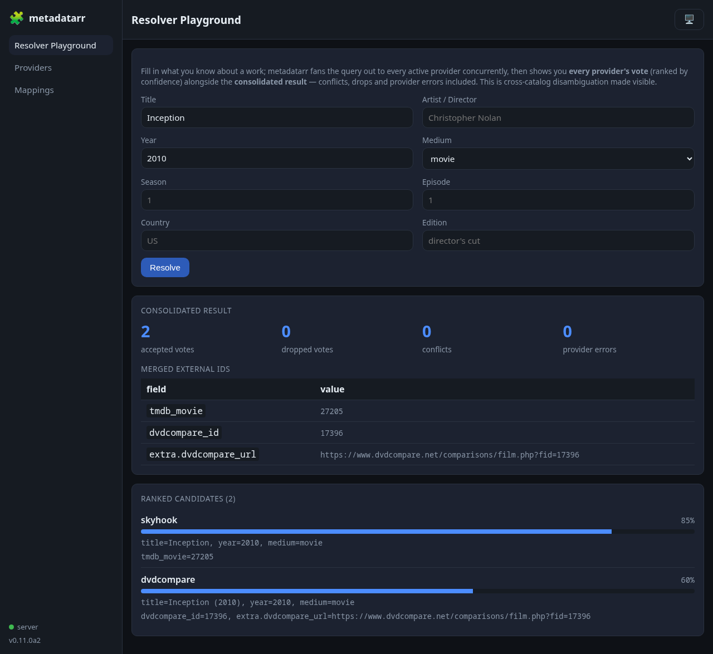
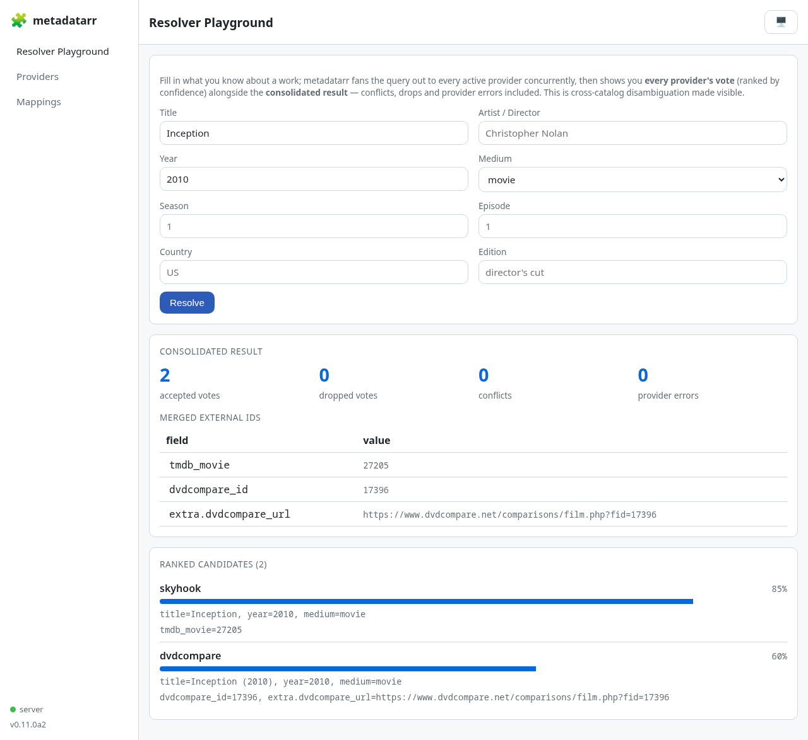
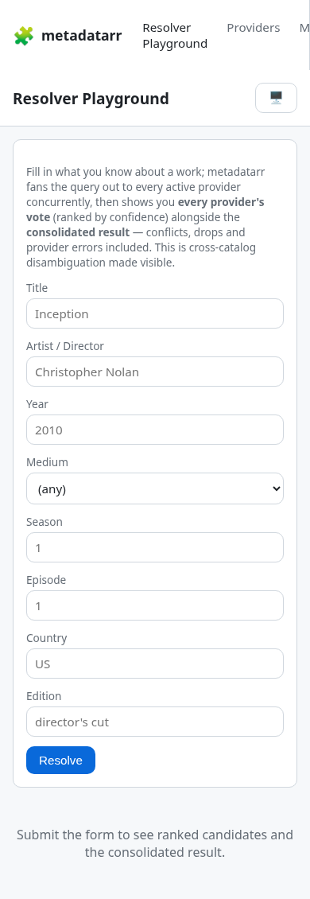
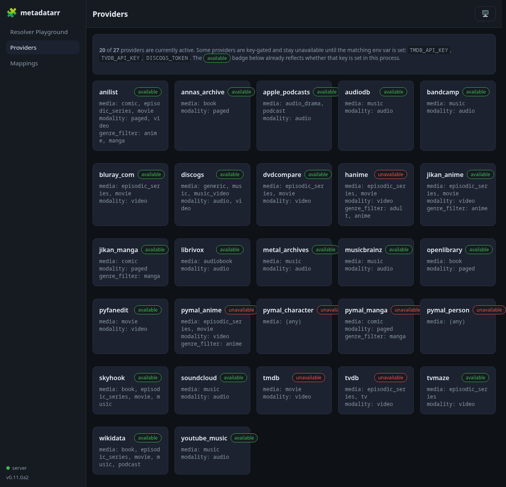
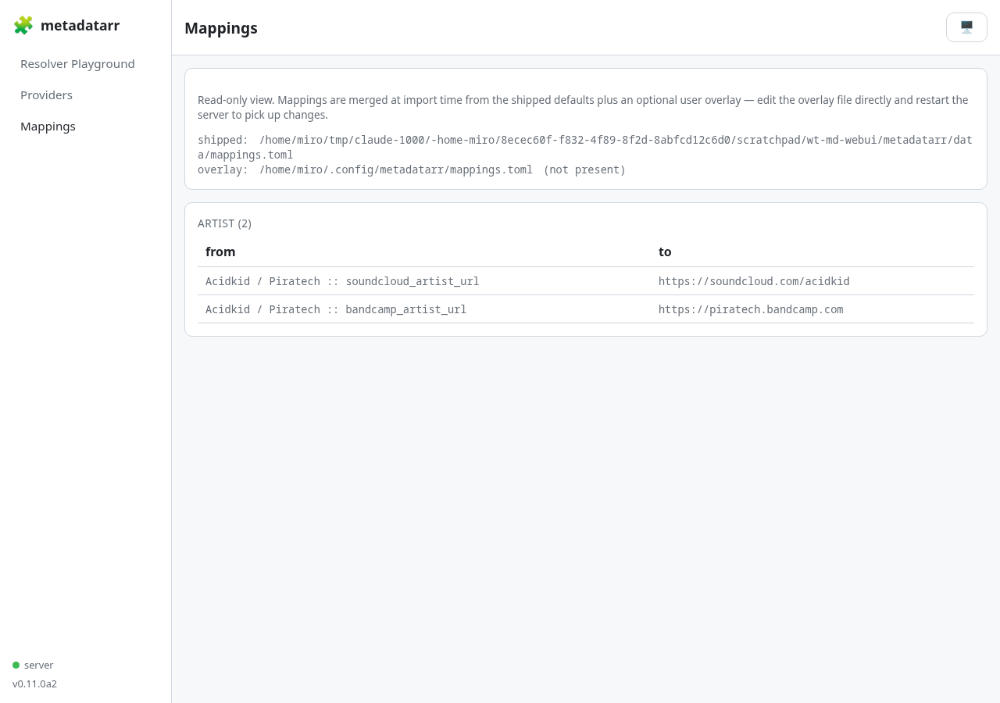

# WebUI

`metadatarr serve` (requires `pip install "metadatarr[server]"`) starts a
FastAPI app with:

- A JSON API (`/resolve`, `/candidates`, `/enrich`, `/providers`, `/healthz`).
- A server-rendered, build-free WebUI at `/`.

No JavaScript build step — the UI is Jinja2 templates plus a locally
vendored [htmx](https://htmx.org) (`metadatarr/server/static/htmx.min.js`).
No CDN calls, no bundler.

## Run it

**pip:**

```bash
pip install "metadatarr[server]"
metadatarr serve
```

Open `http://localhost:8000/`.

**Docker:**

```bash
cd deploy
docker compose up -d --build
```

See [`docs/deploy.md`](deploy.md) for volumes, env vars, and the reverse-proxy note.

## Pages

- **`/` — Resolver Playground.** Fill in the signals you know about a work
  (title, artist, year, medium, season/episode, country, edition) and submit.
  The page fans the query out to every active provider concurrently and shows
  two things side by side: the **ranked candidates** — every provider's raw
  vote, with a confidence bar and the external ids/signals it returned — and
  the **consolidated result** — the merged `external_ids`, plus any
  conflicts, dropped votes, and provider errors surfaced so disambiguation
  stays visible instead of hidden behind a single "best guess."

  
  

  The layout is responsive down to phone width:

  

- **`/ui/providers`** — grid of built-in providers: availability, media
  types served, genre filters. TMDB, TVDB and Discogs providers are
  key-gated (`TMDB_API_KEY`, `TVDB_API_KEY`, `DISCOGS_TOKEN`) — the
  available/unavailable badge reflects whether the key is set in the
  running process.

  

- **`/ui/mappings`** — read-only view of the merged cross-platform identity
  mappings: the shipped `metadatarr/data/mappings.toml` plus the user
  overlay at `$XDG_CONFIG_HOME/metadatarr/mappings.toml`. Edit the overlay
  file directly and restart the server to apply changes — there is no
  in-browser editor by design.

  

## Design

Dark-first palette, light via `prefers-color-scheme` (or the sidebar theme
toggle). Sidebar navigation, health dot polling `/healthz` every 30s. Same
component set (`.card`, `.btn`, `.badge`, `.bar`/`.bar-fill`, `.table`) used
across the LeMetadatarr WebUI family for a consistent look.

## Environment variables

Same variables as the HTTP API / Docker image — see the table in
[`docs/deploy.md`](deploy.md#environment-variables). Most providers work
keyless; `TMDB_API_KEY`, `TVDB_API_KEY`, `DISCOGS_TOKEN` unlock the gated
ones, reflected live on `/ui/providers`.

## No built-in auth

Same as the HTTP API: there is no login, no session, no API key check on
these routes. Fine for a single-tenant homelab box; put it behind a reverse
proxy (Caddy, Traefik, nginx) with your own auth if it's reachable outside
your LAN. See [`docs/deploy.md`](deploy.md#security-note).
